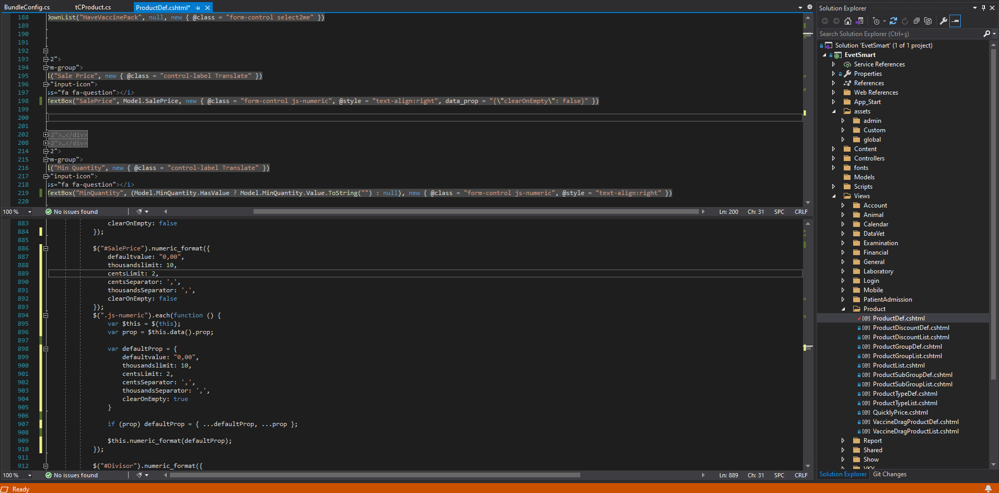

.. ExampleReadTheDocs documentation master file, created by
   sphinx-quickstart on Wed Sep 21 10:00:37 2022.
   You can adapt this file completely to your liking, but it should at least
   contain the root `toctree` directive.

.. toctree::
   :maxdepth: 2
   :hidden:
   :caption: İçerik:

   options/getting_started
   options/tutorial

Başlık 2 
========
Bu yazımızda neler yapacağız.

Tablo oluşumu
--------------
.. list-table:: Sample Table
   :widths: 20 10 10 15
   :header-rows: 1

   * - Title A
     - Title B
     - Title C
     - Title D
   * - C 1.0
     - C 1.1
     - C 1.2
     - C 1.3
   * - C 2.0
     - C 2.1
     - C 2.2
     - C 2.3

Link
-----
Burada normal link verebiliriz.
https://test.evetsmart.com

Burada ise bir string ifadeyi link yapabiliriz.
`Link text <https://test.evetsmart.com>`_  

Listeler 
--------

#. Fransa
    * Paris
    * Lyon
    * Marsilya
#. Rusya
    * Moskova
    * Kazan
    * Samara

Uyarılar 
--------

.. caution::  
   Lorem Ipsum pasajlarının birçok çeşitlemesi vardır. Ancak bunların büyük bir çoğunluğu mizah katılarak veya rastgele sözcükler eklenerek değiştirilmişlerdir.

.. danger::  
   Lorem Ipsum pasajlarının birçok çeşitlemesi vardır. Ancak bunların büyük bir çoğunluğu mizah katılarak veya rastgele sözcükler eklenerek değiştirilmişlerdir.

.. note::  
   Lorem Ipsum pasajlarının birçok çeşitlemesi vardır. Ancak bunların büyük bir çoğunluğu mizah katılarak veya rastgele sözcükler eklenerek değiştirilmişlerdir.

.. tip::  
   Lorem Ipsum pasajlarının birçok çeşitlemesi vardır. Ancak bunların büyük bir çoğunluğu mizah katılarak veya rastgele sözcükler eklenerek değiştirilmişlerdir.
   

Indices and tables
==================

* :ref:`genindex`
* :ref:`modindex`
* :ref:`search`

"Merhaba"
